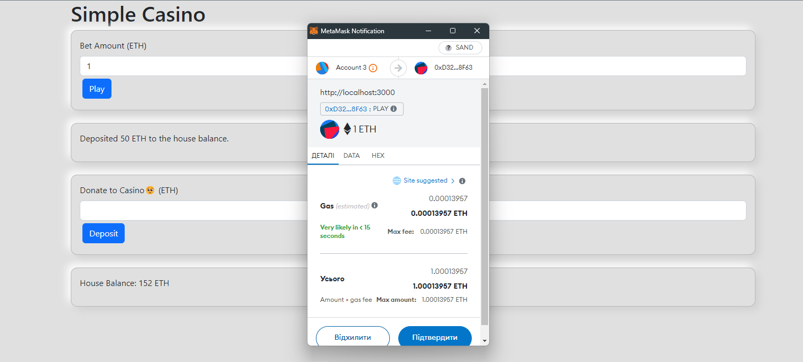

# simple-web3-casino
 
## Steps to run:

### Contract

1. Set up [Ganache](https://trufflesuite.com/ganache/) and make sure that it works consistently with configs in `truffle-config.js` file.

2. Run next commands to run unit tests, to build and to deploy the contract
```angular2html

npm i 

truffle test
truffle build
truffle deploy

```

3. Check your Ganache network that contract has been successfully deployed. 


### UI

1. Navigate to ui folder

```angular2html
cd simple-casino
```

1. Copy json contract data to ui from `build/contracts/SimpleCasino.json` to `simple-casino/src/contracts/SimpleCasino.json`. 
2. Navigate to ui folder and run the project

```angular2html
cd simple-casino

npm i
npm start
```
3. Open http://localhost:3000/ and have fun:)
4. (First donate to your casino to play)



